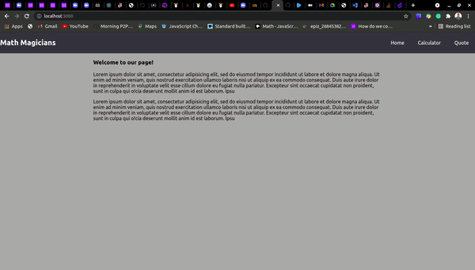

## Calculator-app

This is a calculator app created with react. All basic math calculations can be done.



## See project live version
[Live](https://calculatorr-app.herokuapp.com/)

## Built with
- React
- Big.js

## Getting started
 clone code from repository
 ```
 git clone https://github.com/Byabasaija/Calculator.git
 ```
 navigate to the project directory

 ```
 cd Calculator
 ```

 Run
 ```
 npm install
 npm start
 ```

 ## How to use the calculator app.

To perform the operations:
- User should select the first value from the number button (0 - 9)
- Then  select the operation buttons (-, +, x, ÷, %)
- Followed by select the next value for calculation
- Finally, the user can select the '=' button to perform the calculations.

## Tests
To run tests for this project
- Clone the code in this repository
- Navigate to the project directory
- Run;
```
npm test
```

## Author
👤 **Pascal Byabasaija**

**Github** [Byabasaija](https://github.com/Byabasaija)

**Linkedin** [Pascal Byabasaija](https://linkedin/in/pascal-byabasaija)

**Twitter** [Pascal](https://twitter.com/byabashaijapoet)

## Contribution 

Contributions, requests and issues are all welcome.

## Show your support

Give a ⭐️ if you like this project!
## License
MIT